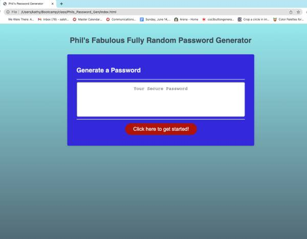
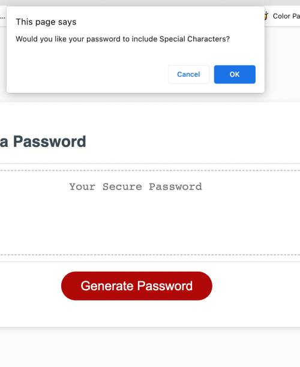
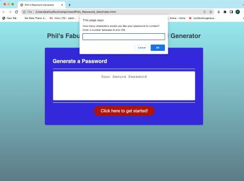
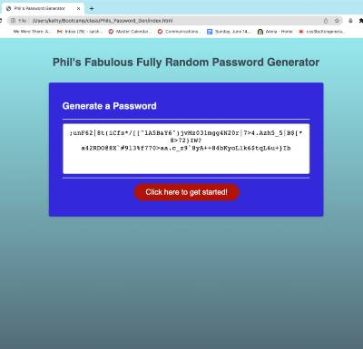

# Phils_Password_Gen

This is a Javascript application that generates a random series of between 8 and 128 characters to be used as a password. It was created for demonatration purposes and should not be considered cryptographically secure.

## Discription

When you open the page and click the "generate password" button you are asked to select characteristics for your password such as if you want to use special characters and/or numbers, etc. as well as how long you want the password to be (between 8 and 128 characters). The program then displays a password that matches those inputs.

## Installation

Navigate to the website: [https://phil-pfister.github.io/Phils_Password_gen/](https://phil-pfister.github.io/Phils_Password_Gen) 

## Credits

I used what I learned in the classroom as well as information from MDN docs and W3 schools websites. I also consulted Stack Overflow and learned about the Durstenfeld Shuffle algorithum. 
I also recieved helpful information from my instructor Brandon Gatlin.

[MDN](https://developer.mozilla.org/en-US/)

[w3school](https://www.w3schools.com/)

[StackOverflow](https://stackoverflow.com/questions/2450954/how-to-randomize-shuffle-a-javascript-array)

## Images

The pages looks like this:

## License

MIT License

© 2023 Phillip Pfister

Permission is hereby granted, free of charge, to any person obtaining a copy of this software and associated documentation files (the “Software”), to deal in the Software without restriction, including without limitation the rights to use, copy, modify, merge, publish, distribute, sublicense, and/or sell copies of the Software, and to permit persons to whom the Software is furnished to do so, subject to the following conditions:

The above copyright notice and this permission notice shall be included in all copies or substantial portions of the Software.

THE SOFTWARE IS PROVIDED “AS IS”, WITHOUT WARRANTY OF ANY KIND, EXPRESS OR IMPLIED, INCLUDING BUT NOT LIMITED TO THE WARRANTIES OF MERCHANTABILITY, FITNESS FOR A PARTICULAR PURPOSE AND NONINFRINGEMENT. IN NO EVENT SHALL THE AUTHORS OR COPYRIGHT HOLDERS BE LIABLE FOR ANY CLAIM, DAMAGES OR OTHER LIABILITY, WHETHER IN AN ACTION OF CONTRACT, TORT OR OTHERWISE, ARISING FROM, OUT OF OR IN CONNECTION WITH THE SOFTWARE OR THE USE OR OTHER DEALINGS IN THE SOFTWARE.

